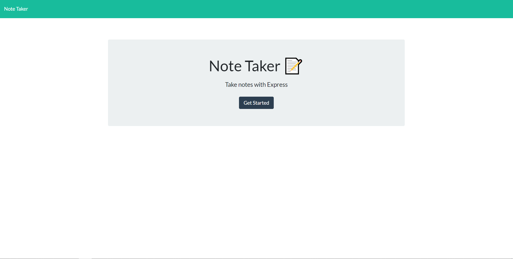
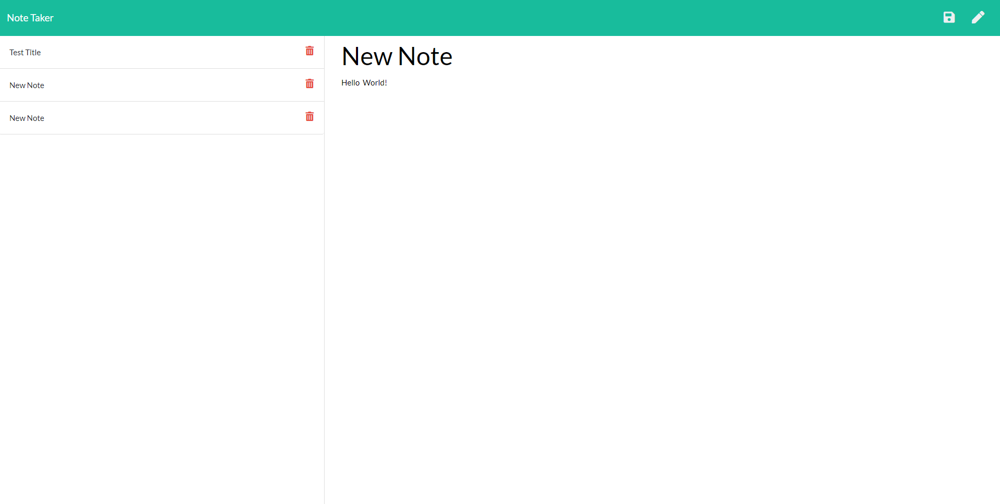

## Table of Contents

- Description 
- Installation
- Usage 
- Languagess used
- Contact

## Description

This application uses Node.js and Express to save notes for the user. This application takes the values of the note Title and text and stores it in the database. The user can add and delete notes as they wish. 

## Installation

To get this application to work, you will need to install Node.js and its dependencies in the integrated terminal. First you will need to install package.json by entering npm init -y in the integrated terminal. Then install its dependencies by entering npm i. Once installed, run the server by typing in npm run start. 

## Usage 

We all have a busy schedule in this ever changing society, and it may be hard to remember everything. With this application, the user will be able to save and deletes notes to keep track of their busy schedule. 

## Languages used 

- Node.js
- JavaScript
- Express
- UUID
- HTML
- CSS

- Contact me!

If you have any questions, concerns, or feedback please contact me at the sources below. Thank you!

Email address: Josephguajardo@ymail.com

GitHub Username: 
